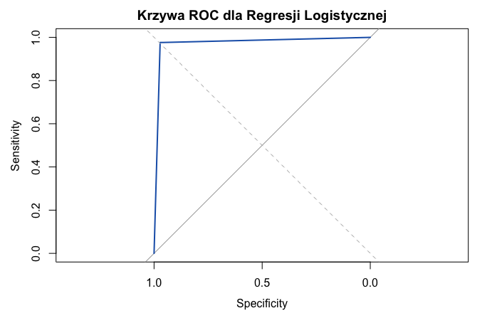

# Analiza i Modelowanie Predykcyjne Raka Piersi w R

## Cel Projektu
Celem tego projektu jest zbudowanie i ocena modelu regresji logistycznej, który potrafi przewidzieć, czy guz piersi jest złośliwy (Malignant) czy łagodny (Benign), na podstawie danych diagnostycznych. Projekt ma na celu zademonstrowanie procesu od przygotowania danych, poprzez budowę modelu, aż po jego walidację i interpretację wyników.

## Zbiór Danych
Wykorzystany zbiór danych to "Breast Cancer Wisconsin (Diagnostic) Data Set", dostępny na platformie Kaggle (https://www.kaggle.com/datasets/alexisbcook/data-for-datavis/data). Zawiera on 30 numerycznych cech, obliczonych na podstawie cyfrowego obrazu aspiratu cienkoigłowego (Fine Needle Aspirate - FNA) mas tkankowych, które opisują charakterystykę jąder komórkowych w próbkach. Kolumna `Diagnosis` (M = złośliwy, B = łagodny) jest zmienną docelową.

## Użyte Narzędzia i Technologie
* **Język programowania:** R
* **Pakiety R:**
    * `readr` (lub `utils` dla `read.csv`) - wczytywanie danych
    * `dplyr` (opcjonalnie, do manipulacji danymi)
    * `caTools` - podział danych na zbiór treningowy i testowy
    * `MASS` - do funkcji `step()` dla selekcji zmiennych
    * `caret` - do macierzy pomyłek i metryk oceny modelu
    * `pROC` - do analizy krzywej ROC i AUC

## Kroki Analizy i Modelowania

Projekt został zrealizowany w następujących etapach:

1.  **Wczytanie i Przygotowanie Danych:**
    * Wczytanie pliku `cancer.csv`.
    * Usunięcie brakujących wartości (`NA`).
    * Usunięcie zbędnej kolumny `Id`.
    * Konwersja zmiennej `Diagnosis` z tekstowej ("M", "B") na numeryczną (1 dla złośliwego, 0 dla łagodnego).
2.  **Skalowanie Zmiennych Numerycznych:**
    * Wszystkie zmienne predykcyjne (poza zmienną `Diagnosis`) zostały przeskalowane do standardowego rozkładu (średnia 0, odchylenie standardowe 1). Ten krok jest kluczowy dla stabilności i zbieżności algorytmu regresji logistycznej, szczególnie przy zmiennych o różnych zakresach wartości.
3.  **Podział Danych:**
    * Dane zostały podzielone na zbiór treningowy (80%) i testowy (20%) w sposób stratyfikowany, co zapewnia zachowanie proporcji klas `Diagnosis` w obu podzbiorach.
4.  **Budowa Modelu Regresji Logistycznej:**
    * Zbudowano początkowy model regresji logistycznej (`glm` z `family='binomial'`) na zbiorze treningowym, używając wszystkich dostępnych predyktorów.
    * **Selekcja Zmiennych:** Ze względu na dużą liczbę silnie skorelowanych predyktorów i potencjalny problem idealnej separowalności (gdzie model może niemal perfekcyjnie dopasować dane treningowe, co prowadzi do niestabilnych współczynników i p-wartości bliskich 1), zastosowano automatyczną eliminację wsteczną (`step()` z pakietu `MASS`). Funkcja ta pomogła wybrać optymalny zestaw zmiennych, minimalizując kryterium AIC.
5.  **Ocena Modelu:**
    * Model został oceniony na niewidzianym wcześniej zbiorze testowym.
    * Wygenerowano prawdopodobieństwa klasyfikacji, które następnie przekonwertowano na binarne przewidywania (0 lub 1) przy użyciu progu 0.5.
    * Obliczono macierz pomyłek (`confusionMatrix`) w celu uzyskania metryk takich jak dokładność (Accuracy), czułość (Sensitivity), swoistość (Specificity) oraz wartości predykcyjnych.
    * Obliczono i zwizualizowano krzywą ROC (Receiver Operating Characteristic) oraz pole pod krzywą (AUC - Area Under the Curve), aby ocenić ogólną zdolność modelu do rozróżniania klas.

## Wyniki Modelu

Mimo początkowych problemów ze stabilnością współczynników (wynikających z idealnej separowalności danych treningowych), model osiągnął **wybitną wydajność predykcyjną** na zbiorze testowym.

### Macierz Pomyłek
Prediction  B   M
B          69   1
M           2  41

* **Prawdziwie Negatywne (TN):** 69 przypadków łagodnych (B) poprawnie sklasyfikowanych jako łagodne.
* **Prawdziwie Pozytywne (TP):** 41 przypadków złośliwych (M) poprawnie sklasyfikowanych jako złośliwe.
* **Fałszywie Pozytywne (FP):** 2 przypadki łagodne (B) błędnie sklasyfikowane jako złośliwe.
* **Fałszywie Negatywne (FN):** 1 przypadek złośliwy (M) błędnie sklasyfikowany jako łagodny.

### Kluczowe Metryki Wydajności

* **Accuracy (Dokładność):** **0.9735** (97.35%) - Model poprawnie sklasyfikował niemal 97.4% wszystkich próbek.
* **Kappa:** **0.9434** - Bardzo silna zgodność między przewidywaniami modelu a rzeczywistymi klasami, korygująca za zgodność przypadkową.
* **Sensitivity (Czułość):** 0.9718 (dla klasy 'B') - Model poprawnie zidentyfikował 97.18% wszystkich rzeczywistych przypadków łagodnych.
* **Specificity (Swoistość):** 0.9762 (dla klasy 'B') - Model poprawnie zidentyfikował 97.62% wszystkich rzeczywistych przypadków złośliwych.
***file(breast_cancer_results)***

### Krzywa ROC i AUC

* **AUC (Area Under the Curve):** **[0.9738]**
    Wartość AUC bliska 1 (maksimum) potwierdza doskonałą zdolność modelu do rozróżniania między guzami łagodnymi a złośliwymi.

## Wnioski
Model regresji logistycznej, po skalowaniu danych i selekcji zmiennych za pomocą kryterium AIC, wykazał się **wyjątkową skutecznością** w klasyfikacji guzów piersi. Wysoka dokładność i wartość AUC na zbiorze testowym świadczą o jego zdolności do trafnego przewidywania diagnozy na nowych danych. Mimo że statystyczne p-wartości współczynników modelu mogą być niestabilne z powodu idealnej separowalności danych treningowych, nie umniejsza to jego wysokiej wartości predykcyjnej.

## Dalsze Kroki (opcjonalnie)
* Eksploracja innych algorytmów klasyfikacji (np. Drzewa Decyzyjne, Random Forest, SVM) i porównanie ich wydajności.
* Zastosowanie regresji logistycznej z regularyzacją (np. Lasso/Ridge z pakietu `glmnet`) w celu uzyskania stabilniejszych i bardziej interpretowalnych współczynników w przypadku separowalności.

## Kontakt
W razie pytań lub sugestii, proszę o kontakt: olivviia
